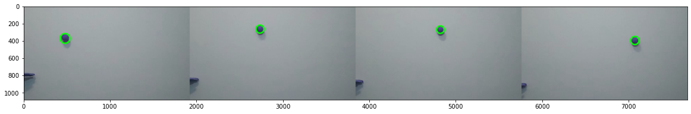

# Ball tracking

This is a project developed to explore and study the computer vision library OpenCV (<a>https://opencv.org</a>). The algorithm tracks the position of a ball thrown, using a homemade video as input. The code was written in a python notebook. Some interesting physical variables were obtained through this code, for example, the acceleration of gravity and the speed of the ball.

# Installation

Clone/Download and run it. The video used as input is already in this repository, namely ball_tracking.mp4.
